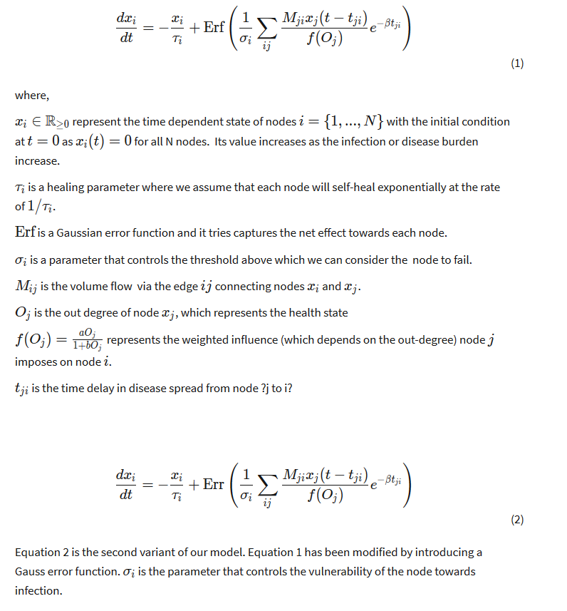
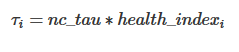
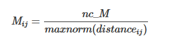

# Intercity Model

Modeling complex phenomenon such as disease spread and its interaction with economy is not a trivial problem. There are many different possible scenarios and questions that can be explored depending on the available data. In this section we will explore some hypothesis and potential questions a modeling excercise could look into. This will then be followed by the set of questions we want to focus on. This will set up the stage for the modeling approach we take and clearly articulate the assumptions on which the models are based on.

To date, there is a comparatively lower number of infections in Nepal with only 9 cases of covid-19 identified. The low number of cases in Nepal is most likely because of the relatively low number of testing. Yet, there are other interesting questions that need to be explored such as how much Nepal’s lack of mass transportation and a very small flow of mobility has impacted the spread. Similarly, most infected people seem to be asymptomatic and it is not clear how the transmission dynamics change in this scenario. In the long run, an evidence based approach is needed for taking potential actions such as partial lockdown, road and air traffic deviation, supply chain re-routing, border (currently open to india) control, health facility mobilization, public awareness regarding the potential outbreak/spread, and potentially, many other planning interventions that have been implemented in other parts of the world.

Strategies and action plans should not only try to maximize the health needs but also take into account the ongoing economic crises that might get much worse in the coming months. 80% of Nepali people live in rural areas primarily depending on agriculture, tourism, and remittance coming from migrant workers. If crops are not planted in the coming months, there is a possibility of a food crisis next year. Healthcare facilities and socio-economic activities are heavily skewed to the capital city Kathmandu and a handful of other urban centres. This means planning and preparation should be based on the available region-wise healthcare resources and deeper understanding of how the risk of pushing millions to poverty and food crisis can be mitigated.

The disaster spread model is based on (Buzna 2007). We represent a geograpahical region (e.g. cities or villages) in a graph. In our case, the N = 753 local level governance units of Nepal (TODO:cite) are considered as nodes and the edges represent the connection between those local units. We will model the temporal dynamics of the properties of interest at these nodes. For example, we can initialize normal state of the nodes in the beginning, then model how a disturbance due to a Coronavirus infection and interaction between nodes change the overall health of the nodes over time.

The time dynamics of the disease spread is modeled by the following equation,

## Data Used

1. District Data:
    - District Name, Headquarters, Geo Coordinates, and Health_Index.

2. Mobility Data:
    - Mobility of people from one district to another in one day.

## Graph Parameters

1. Healing parameter for a node.

2. Mobility parameter for an edge.

The details about the input and output apis can be found [here](intercity_api.json).
